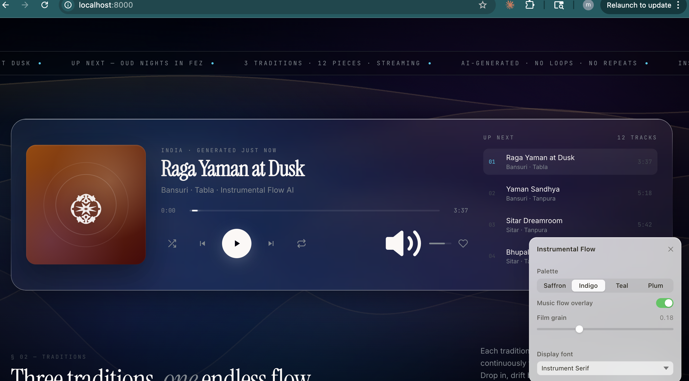

# Instrumental Flow

An AI-generated world-instrumentals streaming page. Three traditions — **India**, **Arabic**, **Japan** — twelve pieces, crossfading continuously.

[](https://codingyoga.github.io/instrumental-flow)

[**→ Open the flow**](https://codingyoga.github.io/instrumental-flow)



## What's inside

- **12 instrumental pieces** generated with Suno Pro, two prompts × two takes per tradition.
- **Crossfading player** — 4-second fade between tracks via dual `<audio>` elements.
- **Three station cards** that jump into each tradition.
- **Customize panel** — palette, font, film grain, music-flow overlay.

## How it's structured

```
index.html          page shell, CSS, React mount
app.jsx             React app — components, audio engine, state
tweaks-panel.jsx    customize panel
tracks.json         audio path config
music-assets/       12 MP3s, organized by tradition
backlog.md          design + decision notes
```

## Run locally

```sh
python3 -m http.server 8000
open http://localhost:8000
```

The `<audio>` element loads `tracks.json` via fetch, which doesn't work on `file://` — a local server is required.

## Tracklist

| Tradition | Pieces |
|---|---|
| India | Raga Yaman at Dusk · Yaman Sandhya · Sitar Dreamroom · Bhupali Tanpura Path |
| Arabic | Oud Nights in Fez · Courtyard Hijaz · Qanun Courtyard · Bayati Garden |
| Japan | Koto Rain on Cedar · Ame no Kotoji · Shakuhachi Mist · Temple Wind Path |
